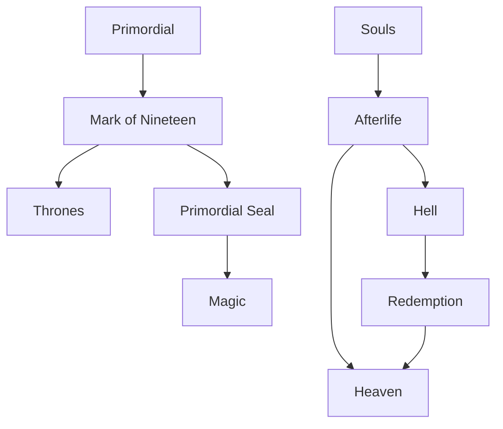

# Concepts

> [!summary]
> The fundamental ideas, systems, and metaphysical rules that define how Elezar exists and functions.

## Cosmology

- [[Primordial]] — the First God and creator associated with the beginning of the world.
- [[Divine Realm]] — the realm connected to divinity and the Thrones.
- [[Afterlife]] — the greater system governing souls after death.

## Fundamental Forces

- [[Magic]] — the supernatural force that shapes and permeates the world.
- [[Souls]] — the spiritual essence of sentient beings.

## Divine Systems

- [[Thrones]] — divine offices granted through godly acts.
- [[Mark of Nineteen]] — the mark and divine challenge that began the Trial.
- [[Primordial Seal]] — the seal that replaced or succeeded the Mark when the Trial ended.

## Time

- [[Calendars]] — the systems used to record the passage of years and divide history.

## Afterlife

- [[Afterlife]]
  - [[Souls]]
  - [[Redemption]]
  - [[Heaven]]
  - [[Hell]]

## Relationships

## Notes

Concept notes explain **what something is and how it works**. Historical changes involving those concepts belong in [[History]], while cultural interpretations belong in [[Stories and Legends]] or [[Cultures]].
